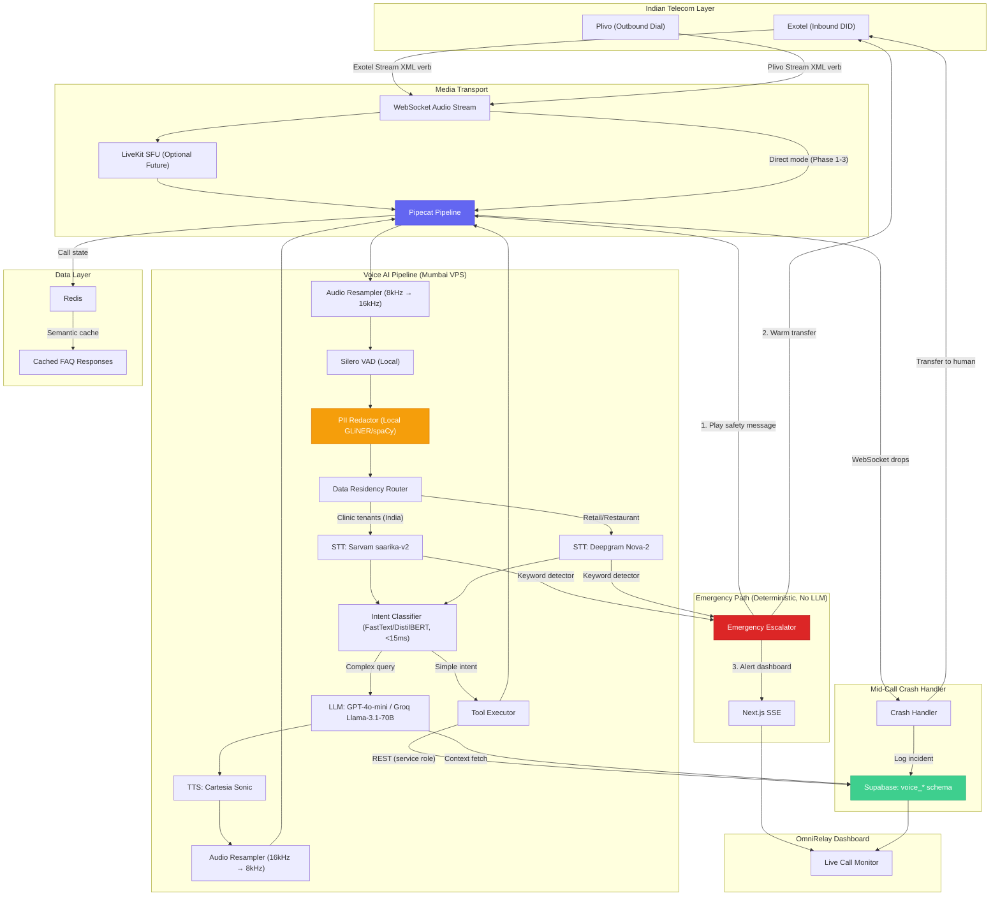
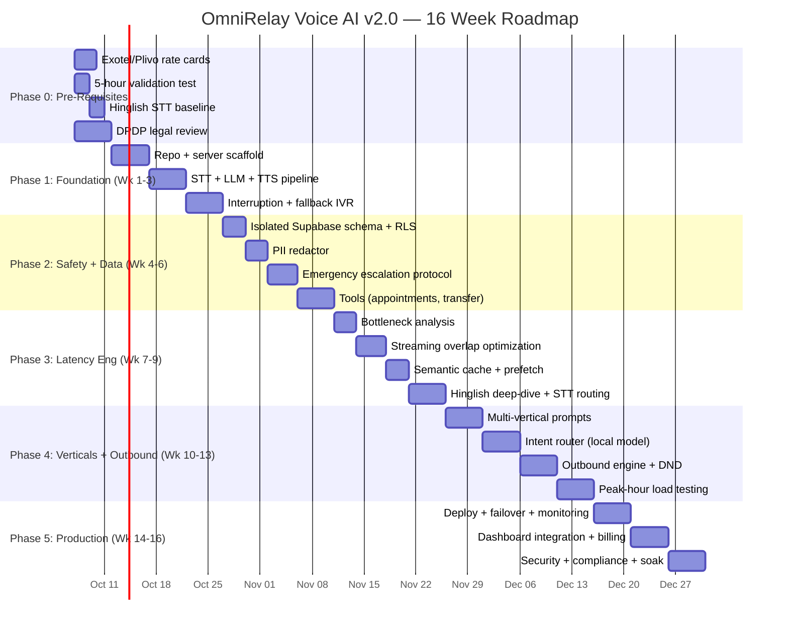

# OmniRelay Voice AI — Final Implementation Plan v2.1

> **Document Type:** CTO Engineering Directive (Final)  
> **Created:** 2 October 2026  
> **Revision:** v2.1 — Final polish after three rounds of review  
> **Status:** ✅ APPROVED FOR PHASE 0  
> **Classification:** Parked Initiative — Activates on Clinic Commercial Gate

---

## Revision Log

| Version | Change Summary |
|---|---|
| v1.0 | Original 10-week plan |
| v2.0 | Extended to 16 weeks. Added: dedicated latency engineering phase, emergency escalation protocol, DPDP Act PII redaction, isolated Supabase schema, peak-hour load testing, LiveKit media gateway, semantic caching, verified Exotel contract gate, and explicit commercial trigger conditions. |
| v2.1 | Final polish. Added: 8kHz↔16kHz audio resampler, replaced Qwen 1.5B with FastText/DistilBERT for intent routing (<15ms), data residency router (Sarvam for clinics, Deepgram for retail), DPA mandates from all cloud providers, mid-call WebSocket crash handler, Jio 4G mobile network testing requirement, real-time DND check at dial-time. |

> [!CAUTION]
> **Development does NOT begin until ALL three commercial gates are cleared:**
> 1. ≥ 3 clinic tenants paying and renewed at least once
> 2. WhatsApp send pipeline stable in production for 30+ consecutive days
> 3. Monthly recurring clinic revenue exceeds ₹25,000
>
> Until then, this document is a **parked blueprint** — not an active work item.

---

## Executive Summary

Build a self-hosted, low-latency Voice AI agent using the Pipecat framework, operating as an isolated microservice with its own data boundary. Once verified against real Indian telecom conditions, this service plugs into every OmniRelay vertical through a thin API bridge.

**Key changes from v1.0:**
- Timeline extended from 10 weeks to **16 weeks** (realistic for voice AI)
- Latency engineering is now its own **dedicated 3-week phase**, not a cleanup task
- **Emergency escalation protocol** added as a critical-path deliverable for healthcare
- **DPDP Act 2023** PII redaction middleware is mandatory before any cloud API call
- Supabase access uses an **isolated schema** with dedicated RLS policies
- All third-party pricing is **verified against signed contracts** before margin tables are trusted
- Peak-hour load testing uses **realistic clinic morning rush patterns**, not averaged figures

---

## 1. System Architecture (Revised)



### Key Architectural Decisions (Changed from v1.0)

| Decision | v1.0 | v2.0 | Rationale |
|---|---|---|---|
| **Media transport** | FastAPI WebSocket only | Exotel Stream verb → Pipecat (direct); LiveKit reserved for SIP trunk phase | Exotel's `<Stream>` XML verb provides native WebSocket audio without needing a SIP media gateway. LiveKit is reserved for when/if we move to raw SIP trunking. |
| **PII handling** | None | Local PII redactor before any cloud API | DPDP Act 2023 compliance. Patient names, phone numbers, and medical terms are stripped before reaching Deepgram/OpenAI. |
| **Emergency path** | Folded into "safety guardrails" | Dedicated deterministic keyword detector, bypasses LLM entirely | A patient describing chest pain cannot wait for LLM inference. This path triggers in <100ms via keyword matching. |
| **Supabase access** | Direct queries to production tables | Isolated `voice_*` schema with dedicated service role and RLS | A bug in the Python service cannot corrupt the main app's appointment or patient data. |
| **Failover** | "Hot standby VPS" | Stateless workers behind a SIP-aware proxy (Kamailio) or Exotel's own fallback URL | Active WebSocket sessions cannot be "handed off" to a standby server. Instead, Exotel is configured with a fallback URL that plays an IVR message if the primary webhook fails. |
| **LLM routing** | All queries to GPT-4o-mini | FastText/DistilBERT intent classifier (<15ms on CPU) routes simple intents to direct tool calls, complex queries to cloud LLM | Qwen 1.5B on CPU takes 300-800ms — destroys latency gains. FastText classifies in <15ms. |
| **Audio resampling** | Not addressed | Bidirectional 8kHz↔16kHz resampler in pipeline | Exotel streams 8kHz mulaw. STT/TTS APIs expect 16kHz+. Without resampling, audio is distorted or rejected. |
| **STT data residency** | Same provider for all tenants | Data residency router: Sarvam AI (India-hosted) for clinic tenants, Deepgram for retail/restaurant | DPDP Act 2023 — clinic audio containing patient PII must stay in India unless DPA signed. |
| **Mid-call failure** | Not addressed | WebSocket crash handler: catch exception → transfer to human → log incident | Exotel terminates the call on WebSocket drop. Patient hears dead air. Must transfer gracefully. |

---

## 2. Repository Structure (Revised)

```
omnirelay-voice/
├── README.md
├── pyproject.toml
├── Dockerfile
├── docker-compose.yml
├── .env.example
│
├── server/
│   ├── main.py                       # FastAPI entry point
│   ├── routes/
│   │   ├── inbound.py                # POST /incoming (Exotel webhook)
│   │   ├── outbound.py               # POST /dial (dashboard trigger)
│   │   ├── websocket.py              # WS /ws (audio stream)
│   │   ├── health.py                 # GET /health (monitoring)
│   │   └── emergency.py              # POST /emergency-alert (→ dashboard SSE)
│   ├── config.py
│   ├── middleware.py                  # Auth, rate limit, request logging
│   └── auth.py                       # HMAC signature verification for Exotel
│
├── pipeline/
│   ├── factory.py                    # Creates Pipecat pipeline per call
│   ├── audio_resampler.py            # *** v2.1: 8kHz ↔ 16kHz bidirectional ***
│   ├── stt.py                        # Deepgram / Sarvam adapter
│   ├── llm.py                        # OpenAI / Groq adapter
│   ├── tts.py                        # Cartesia adapter
│   ├── vad.py                        # Silero VAD (local, no cloud)
│   ├── pii_redactor.py               # Local PII stripping
│   ├── emergency_detector.py         # Keyword-based escalation
│   └── intent_router.py              # *** v2.1: FastText/DistilBERT, NOT Qwen ***
│
├── agents/
│   ├── base_agent.py
│   ├── receptionist.py               # AI Receptionist (inbound)
│   ├── sales_agent.py                # AI Sales Agent (outbound)
│   └── reminder_agent.py             # Appointment reminder (outbound)
│
├── prompts/
│   ├── receptionist/
│   │   ├── clinic.md
│   │   ├── restaurant.md
│   │   └── retail.md
│   ├── sales/
│   │   ├── lead_qualification.md
│   │   └── appointment_reminder.md
│   └── safety/
│       ├── guardrails.md             # General safety rules
│       ├── emergency_protocol.md     # *** NEW: Emergency escalation script ***
│       └── handoff_protocol.md       # When/how to transfer to human
│
├── tools/
│   ├── supabase_client.py            # Uses voice-specific service role
│   ├── appointment.py                # Book / Reschedule / Cancel
│   ├── faq_lookup.py                 # RAG query
│   ├── call_transfer.py              # Exotel/Plivo warm transfer
│   ├── crm_update.py                 # Log call outcome
│   ├── sms_confirm.py                # Post-call SMS/WhatsApp
│   └── dnd_scrubber.py               # *** NEW: TRAI NDNC registry check ***
│
├── compliance/
│   ├── dpdp_redaction.py             # DPDP Act 2023 PII rules
│   ├── data_residency_router.py      # *** v2.1: Routes STT by tenant sensitivity ***
│   ├── trai_dnd.py                   # Daily NDNC sync
│   ├── trai_realtime_dnd.py          # *** v2.1: Real-time DND check at dial-time ***
│   └── emergency_keywords.json      # Configurable trigger words
│
├── cache/
│   ├── semantic_cache.py             # *** NEW: Redis + embedding cache ***
│   └── faq_warmup.py                 # *** NEW: Pre-warm FAQ cache on startup ***
│
├── tests/
│   ├── test_pipeline.py
│   ├── test_tools.py
│   ├── test_pii_redactor.py          # *** NEW ***
│   ├── test_emergency_detector.py    # *** NEW ***
│   ├── test_dnd_scrubber.py          # *** NEW ***
│   ├── test_latency.py
│   ├── test_peak_load.py             # *** NEW: Clinic morning rush simulation ***
│   ├── test_audio_resampler.py        # *** v2.1: Verify 8kHz↔16kHz conversion ***
│   ├── test_mid_call_crash.py         # *** v2.1: Simulate WebSocket drop during call ***
│   ├── test_data_residency.py         # *** v2.1: Verify clinic→Sarvam, retail→Deepgram ***
│   ├── test_realtime_dnd.py           # *** v2.1: Verify dial-time DND check ***
│   └── fixtures/
│       ├── sample_audio_8khz.wav      # *** v2.1: Actual Exotel mulaw sample ***
│       ├── sample_audio_16khz.wav     # *** v2.1: Expected STT input format ***
│       ├── hinglish_samples/
│       │   ├── booking_hinglish.wav
│       │   ├── emergency_hindi.wav
│       │   └── cancel_tanglish.wav
│       ├── emergency_phrases.json    # *** NEW: Test emergency detection ***
│       └── mock_exotel_webhook.json
│
├── benchmarks/
│   ├── latency_tracker.py            # *** NEW: Continuous latency monitoring ***
│   ├── hinglish_accuracy.py          # *** NEW: STT accuracy on mixed speech ***
│   └── results/                      # *** NEW: Historical benchmark data ***
│
├── scripts/
│   ├── benchmark.py
│   ├── seed_test_tenant.py
│   ├── simulate_call.py
│   └── sync_ndnc_registry.py        # *** NEW: TRAI DND sync cron ***
│
└── deploy/
    ├── nginx.conf
    ├── systemd/omnirelay-voice.service
    ├── exotel_fallback_ivr.xml       # *** NEW: Plays if server unreachable ***
    └── scripts/
        ├── setup_server.sh
        └── deploy.sh
```

---

## 3. Phased Implementation Roadmap (Revised — 16 Weeks)

### Phase 0: Pre-Requisites (Before Day 1)

> **Goal:** Remove all assumptions. Verify the physics work before writing a line of code.

| # | Task | Deliverable | Owner |
|---|---|---|---|
| 0.1 | **Contact Exotel sales.** Get a signed rate card for: DID rental, per-minute inbound, per-minute outbound, `<Stream>` WebSocket pricing, and bulk tiers. | Signed commercial terms document | Business |
| 0.2 | **Contact Plivo India sales.** Get equivalent rate card for outbound dialing. | Signed commercial terms document | Business |
| 0.3 | **Run the 5-hour validation test.** Buy one Exotel DID (₹500). Deploy the unmodified `pipecat-ai/pipecat-examples/exotel-chatbot` on a Mumbai VPS. Call it from **Jio 4G and Airtel 4G mobile networks** (not office Wi-Fi). Measure actual latency and WebSocket stability under mobile network jitter. | Latency measurement report on real Indian mobile networks | Engineering |
| 0.4 | **Test Hinglish STT accuracy.** Record 20 mixed Hindi-English utterances. Run them through Deepgram Nova-2 and Sarvam saarika-v2. Score word-error-rate. | STT accuracy comparison spreadsheet | Engineering |
| 0.5 | **Legal review of DPDP Act 2023.** Confirm what PII categories must be redacted before sending to US-hosted APIs for a healthcare use case. | Legal sign-off on PII redaction requirements | Legal |
| 0.6 | **Secure signed DPAs.** Obtain Data Processing Agreements from Deepgram, Cartesia, and OpenAI guaranteeing: (a) no audio/text used for model training, (b) ephemeral processing, (c) data deletion on request. If any provider refuses, they are disqualified for clinic vertical. | Signed DPAs or disqualification memo | Legal |
| 0.7 | **Test audio format.** Capture raw Exotel `<Stream>` audio. Verify codec (mulaw/linear16), sample rate (8kHz), and frame size. Document exact resampling requirements for STT/TTS providers. | Audio format specification document | Engineering |

**Phase 0 Exit Gate:**
- [ ] Exotel and Plivo rate cards signed and filed
- [ ] Actual Mumbai latency measured (not theoretical)
- [ ] Hinglish STT accuracy baseline established
- [ ] DPDP PII requirements documented

> [!WARNING]
> If Phase 0 reveals that actual Exotel latency exceeds 1,200ms or Hinglish accuracy is below 75%, the project returns to "parked" status until the technology matures.

---

### Phase 1: Foundation & Audio Pipeline (Week 1–3)

> **Goal:** A phone rings. A bot answers. Audio flows bidirectionally with measured latency.

| Week | Day | Task | Deliverable |
|---|---|---|---|
| 1 | 1 | Set up `omnirelay-voice` repo, `pyproject.toml`, Docker, CI | Project scaffolded |
| 1 | 2 | Install Pipecat, scaffold with Exotel template | `pipecat init` working |
| 1 | 3 | FastAPI server: `/incoming`, `/ws`, `/health` routes | Server boots |
| 1 | 4 | Configure Exotel DID → webhook URL, test `<Stream>` verb | Exotel hits server, WebSocket opens |
| 1 | 5 | **Build `audio_resampler.py`** — bidirectional 8kHz mulaw ↔ 16kHz linear16 conversion using Pipecat's built-in Resampler | Audio format bridge working |
| 1 | 6 | Wire Silero VAD (local) — detect speech vs. silence on resampled audio | VAD working without cloud calls |
| 2 | 7 | Wire Deepgram STT — speech appears as text in console | STT streaming verified |
| 2 | 8 | Wire GPT-4o-mini with hardcoded clinic prompt | Bot "thinks" a response |
| 2 | 9 | Wire Cartesia TTS + downsample 16kHz output → 8kHz for Exotel | End-to-end audio loop working |
| 2 | 9 | Build `benchmarks/latency_tracker.py` — measure every call's TTA | Latency data collection started |
| 2 | 10 | Test with 3 different phones (Android, iPhone, landline) on **Jio 4G and Airtel 4G** | Cross-device + cross-network audio quality verified |
| 3 | 11 | Implement Pipecat interruption handling (barge-in) | Bot stops speaking when user interrupts |
| 3 | 12 | **Build mid-call WebSocket crash handler** in `websocket.py` — on exception: (1) transfer call to clinic human number via Exotel `<Dial>`, (2) log incident | Graceful mid-call failure handling |
| 3 | 13 | Implement call recording (local storage, encrypted) | Every test call recorded for review |
| 3 | 13 | Build Exotel fallback IVR XML (plays if server is down) | Graceful degradation verified |
| 3 | 14-15 | First latency audit — analyze 50+ calls, identify bottlenecks | Latency audit report v1 |

**Phase 1 Exit Criteria:**
- [ ] Call the number → bot answers within 1.5 seconds
- [ ] Say something → bot responds coherently
- [ ] Audio resampling verified: no distortion, no chipmunk effect
- [ ] Latency tracker logging every call's Time-to-Audio (TTA)
- [ ] Median TTA documented (target: < 1,200ms at this stage)
- [ ] Interruption handling works (user can cut off bot mid-sentence)
- [ ] Mid-call crash handler tested: kill process → call transfers to human, not dead air
- [ ] Fallback IVR plays when server is deliberately shut down

---

### Phase 2: Data Isolation, PII & Emergency Protocol (Week 4–6)

> **Goal:** The bot reads production data safely, strips PII before cloud calls, and handles medical emergencies deterministically.

| Week | Day | Task | Deliverable |
|---|---|---|---|
| 4 | 16 | **Create isolated Supabase schema.** Create `voice_call_logs`, `voice_sessions` tables. Create a dedicated `voice_service` role with Row Level Security. | Isolated data boundary |
| 4 | 17 | **Build read-only views.** Create Supabase views (`voice_appointments_readonly`, `voice_org_config_readonly`) that the Python service can query but cannot write to. | Read-only access to production data |
| 4 | 18 | Build `supabase_client.py` — uses `voice_service` role exclusively | Supabase integration working safely |
| 4 | 19 | Build `pii_redactor.py` — local GLiNER/spaCy model strips names, phone numbers, Aadhaar numbers, medical conditions from text before sending to OpenAI | PII redactor working |
| 4 | 19b | **Build `data_residency_router.py`** — routes STT audio to Sarvam AI (India-hosted) for clinic tenants, Deepgram (US) for retail/restaurant tenants. Add `data_residency` flag to org config view. | Data residency routing verified |
| 4 | 20 | Unit test PII redactor with 100 sample Indian clinic utterances | PII redaction accuracy > 95% |
| 5 | 21 | **Build `emergency_detector.py`.** Keyword + phrase matching for: chest pain, bleeding, accident, unconscious, can't breathe, suicide, heart attack (English + Hindi + Hinglish). | Emergency detector working |
| 5 | 22 | **Build emergency escalation flow.** On trigger: (1) Immediately play pre-recorded safety message: "This sounds urgent. Please call 112 for emergency services. I am connecting you to the clinic now." (2) Warm transfer to clinic's emergency number. (3) Send SSE alert to OmniRelay dashboard. | Emergency flow end-to-end |
| 5 | 23 | Test emergency detector with 50 adversarial phrases (false positives + false negatives) | False negative rate < 2% |
| 5 | 24 | Build `POST /emergency-alert` route — pushes to dashboard via SSE | Dashboard receives emergency alert |
| 5 | 25 | Dynamic system prompt injection based on `tenant.vertical` | Different persona per tenant |
| 6 | 26 | Build `appointment.py` — read appointments via readonly view | Bot reads appointment data |
| 6 | 27 | Build `call_transfer.py` — Exotel warm transfer to human | "Let me connect you to the doctor" |
| 6 | 28 | Build `crm_update.py` — log call outcome to `voice_call_logs` | Call logging working |
| 6 | 29-30 | Security audit: verify RLS policies, PII redaction, emergency paths | Security audit report |

**Phase 2 Exit Criteria:**
- [ ] Python service CANNOT write to `appointments`, `organizations`, or `contacts` tables directly
- [ ] PII redactor strips patient names and phone numbers before any text reaches OpenAI
- [ ] Saying "I'm having chest pain" triggers emergency flow within 100ms (no LLM involved)
- [ ] Emergency transfers tested on real Exotel calls
- [ ] Every call logged in `voice_call_logs` with transcript, duration, outcome

### Supabase Schema (Revised — Isolated)

```sql
-- ============================================================
-- VOICE AI SCHEMA — Isolated from main application tables
-- ============================================================

-- Dedicated service role for voice server
-- (created via Supabase dashboard, NOT the main anon/service_role key)

-- Read-only views for production data access
CREATE VIEW voice_appointments_readonly AS
  SELECT id, org_id, patient_name, patient_phone, 
         scheduled_at, status, provider_name
  FROM appointments
  WHERE status IN ('confirmed', 'pending');

CREATE VIEW voice_org_config_readonly AS
  SELECT id, name, vertical, operating_hours, 
         emergency_phone, timezone
  FROM organizations
  WHERE subscription_status = 'active';

-- Voice-owned tables (full read/write)
CREATE TABLE voice_call_logs (
  id UUID PRIMARY KEY DEFAULT gen_random_uuid(),
  org_id UUID NOT NULL,
  contact_phone TEXT NOT NULL,
  direction TEXT NOT NULL CHECK (direction IN ('inbound', 'outbound')),
  agent_type TEXT NOT NULL CHECK (agent_type IN ('receptionist', 'sales', 'reminder')),
  vertical TEXT NOT NULL CHECK (vertical IN ('clinic', 'restaurant', 'retail')),
  duration_seconds INTEGER DEFAULT 0,
  outcome TEXT CHECK (outcome IN (
    'resolved', 'transferred', 'voicemail', 
    'no_answer', 'busy', 'failed', 'emergency_escalated'
  )),
  transcript_redacted JSONB DEFAULT '[]',
  summary TEXT,
  tags TEXT[] DEFAULT '{}',
  tools_used TEXT[] DEFAULT '{}',
  latency_p50_ms INTEGER,
  latency_p99_ms INTEGER,
  cost_inr NUMERIC(8,2) DEFAULT 0,
  pii_redacted BOOLEAN DEFAULT true,
  emergency_triggered BOOLEAN DEFAULT false,
  created_at TIMESTAMPTZ DEFAULT now()
);

CREATE TABLE voice_sessions (
  id UUID PRIMARY KEY DEFAULT gen_random_uuid(),
  call_log_id UUID REFERENCES voice_call_logs(id),
  exotel_call_sid TEXT,
  websocket_connected_at TIMESTAMPTZ,
  first_audio_at TIMESTAMPTZ,
  stt_provider TEXT,
  llm_provider TEXT,
  tts_provider TEXT,
  total_stt_ms INTEGER,
  total_llm_ms INTEGER,
  total_tts_ms INTEGER,
  created_at TIMESTAMPTZ DEFAULT now()
);

CREATE TABLE voice_emergency_events (
  id UUID PRIMARY KEY DEFAULT gen_random_uuid(),
  call_log_id UUID REFERENCES voice_call_logs(id),
  trigger_phrase TEXT NOT NULL,
  detection_ms INTEGER NOT NULL,
  transfer_initiated BOOLEAN DEFAULT false,
  dashboard_alerted BOOLEAN DEFAULT false,
  created_at TIMESTAMPTZ DEFAULT now()
);

-- Row Level Security
ALTER TABLE voice_call_logs ENABLE ROW LEVEL SECURITY;
ALTER TABLE voice_sessions ENABLE ROW LEVEL SECURITY;
ALTER TABLE voice_emergency_events ENABLE ROW LEVEL SECURITY;

CREATE POLICY voice_service_all ON voice_call_logs
  FOR ALL USING (true) WITH CHECK (true);
  -- Only the voice_service role can access these tables

CREATE INDEX idx_vcl_org ON voice_call_logs(org_id, created_at DESC);
CREATE INDEX idx_vcl_phone ON voice_call_logs(contact_phone);
CREATE INDEX idx_vcl_emergency ON voice_call_logs(emergency_triggered) 
  WHERE emergency_triggered = true;
```

---

### Phase 3: Latency Engineering (Week 7–9)

> **Goal:** Get Time-to-Audio (TTA) reliably below 900ms on Indian mobile networks. This is the hardest phase.

> [!IMPORTANT]
> This was 3 days in v1.0. It is now **3 full weeks**. This phase is the difference between a product that feels human and one that feels robotic. Do not rush it.

| Week | Day | Task | Deliverable |
|---|---|---|---|
| 7 | 31 | Analyze 200+ latency measurements from Phase 1-2. Identify the slowest component (STT? LLM? TTS? Network?) | Bottleneck identification report |
| 7 | 32 | Implement STT streaming optimization — partial results fed to LLM before utterance completes | Overlapped STT→LLM pipeline |
| 7 | 33 | Implement TTS streaming — first audio chunk plays while remaining chunks generate | Overlapped LLM→TTS pipeline |
| 7 | 34 | Test Groq (Llama-3.1-70B) as LLM alternative — compare TTFT vs GPT-4o-mini | LLM latency comparison |
| 7 | 35 | Test hosting Pipecat on US-East VPS (closer to APIs) vs Mumbai VPS (closer to caller) | Optimal server location determined |
| 8 | 36 | Build `cache/semantic_cache.py` — cache FAQ answers in Redis using embedding similarity | Cache hit on "What are your hours?" skips LLM+TTS entirely |
| 8 | 37 | Build `cache/faq_warmup.py` — pre-warm cache with top 20 FAQs per tenant on startup | Cold-start penalty eliminated |
| 8 | 38 | Implement pre-fetch: while user is still speaking, prefetch tenant context from Supabase | Eliminates Supabase latency from hot path |
| 8 | 39 | Implement adaptive VAD thresholds — shorter silence = faster bot response on slow connections | Latency adapts to network conditions |
| 8 | 40 | A/B test Cartesia vs ElevenLabs Turbo v2.5 on Indian-English voice quality and TTFB | Best TTS provider selected |
| 9 | 41-42 | **Hinglish deep-dive.** Test Sarvam saarika-v2 against Deepgram Nova-2 on 100 mixed-code utterances. Build a routing heuristic that selects STT provider based on first 2 seconds of audio. | Hinglish accuracy > 85% on mixed speech |
| 9 | 43 | Build continuous latency dashboard (logs to `voice_sessions` table) | Real-time latency visibility |
| 9 | 44-45 | Final latency optimization sprint — target: median TTA < 900ms, p99 < 1,500ms | Latency targets hit |

**Phase 3 Exit Criteria:**
- [ ] Median Time-to-Audio: **< 900ms** (measured over 500+ calls)
- [ ] p99 Time-to-Audio: **< 1,500ms**
- [ ] Semantic cache hit rate: **> 25%** on FAQ-heavy tenants
- [ ] Hinglish STT accuracy: **> 85%** on mixed-code test set
- [ ] Optimal server location documented with data

---

### Phase 4: Multi-Vertical & Outbound Engine (Week 10–13)

> **Goal:** One pipeline serves clinics, restaurants, and retail. Outbound calling works with TRAI compliance.

| Week | Day | Task | Deliverable |
|---|---|---|---|
| 10 | 46-47 | Write and test clinic receptionist prompt + tools | Clinic vertical fully functional |
| 10 | 48-49 | Write and test restaurant host prompt + tools | Restaurant vertical fully functional |
| 10 | 50 | Write and test retail assistant prompt + tools | Retail vertical fully functional |
| 11 | 51 | Build prompt routing logic based on `tenant.vertical` | Auto-routing verified |
| 11 | 52 | A/B test voice selection (male/female, accent) per vertical | Best voice per vertical selected |
| 11 | 53 | **Build intent classifier** (`intent_router.py`) using **FastText or DistilBERT** (NOT Qwen 1.5B — too slow on CPU). Train on labeled intents: cancel, reschedule, hours, location, pricing, book, transfer, other. | Classifier runs in <15ms on CPU |
| 11 | 54-55 | Test classifier accuracy on 200 utterances across all verticals. Verify latency < 15ms per classification. | Accuracy > 90%, latency < 15ms |
| 12 | 56 | Build `POST /dial` endpoint — outbound call triggering | Dashboard can trigger calls |
| 12 | 57 | Build `reminder_agent.py` — appointment reminder logic | Reminder calls working |
| 12 | 58 | Build `sales_agent.py` — outbound lead qualification | Sales calls working |
| 12 | 59 | **Build `dnd_scrubber.py`.** Two layers: (1) Daily NDNC registry sync for dashboard UI filtering, (2) **Real-time Exotel/Plivo DND API check at the exact millisecond of dialing** in the `POST /dial` handler. A 24-hour-old cache is NOT sufficient for TRAI compliance. | DND scrubbing verified (real-time + cached) |
| 12 | 60 | Build batch dialer with queue management (Redis) | Bulk campaigns working |
| 13 | 61 | Build `POST /api/voice/dial` bridge route in Next.js | Dashboard → Python bridge |
| 13 | 62 | Build call outcome tracking (answered, voicemail, busy, DND-blocked) | Outcome analytics working |
| 13 | 63-65 | **Peak-hour load testing.** Simulate realistic clinic morning rush: 40 concurrent inbound calls between 9:00-9:30 AM, then 15 concurrent for rest of day. Measure degradation. | Peak load report |

**Phase 4 Exit Criteria:**
- [ ] Call same number with 3 different tenants → 3 different personas respond
- [ ] Outbound reminder call: patient confirms, Supabase updated
- [ ] DND-registered test number is NEVER dialed (verified with Exotel logs)
- [ ] System handles **40 concurrent calls** without quality degradation
- [ ] Intent router handles 90%+ of "cancel" / "reschedule" / "hours" without cloud LLM

---

### Phase 5: Production Hardening & Integration (Week 14–16)

> **Goal:** Ship it. Monitor it. Bill for it. Survive failures gracefully.

| Week | Day | Task | Deliverable |
|---|---|---|---|
| 14 | 66 | Deploy to production Mumbai VPS (8 vCPU, 16GB) with Nginx + TLS | `wss://` working in production |
| 14 | 67 | Set up systemd service with auto-restart + resource limits | Zero-downtime operations |
| 14 | 68 | Configure Exotel fallback URL → plays IVR message if primary server unreachable | Graceful degradation in production |
| 14 | 69 | Test real failover: kill the server process, verify IVR plays, verify auto-restart | Failover verified on live telecom |
| 14 | 70 | Sentry integration for Python server | Production error monitoring |
| 15 | 71 | Build live transcript streaming (SSE → Next.js dashboard) | Real-time call visibility |
| 15 | 72 | Build call history page in OmniRelay dashboard | Searchable call logs in UI |
| 15 | 73 | Build emergency event dashboard panel (highlighted, non-dismissable) | Emergency calls highly visible |
| 15 | 74 | Implement per-tenant minute metering (`voice_call_logs.cost_inr`) | Usage tracking for billing |
| 15 | 75 | Connect metering to OmniRelay billing system | Auto-billing per minute |
| 16 | 76 | Full security audit: RLS, PII redaction, auth, TLS, emergency paths | Security sign-off |
| 16 | 77 | DPDP Act compliance audit with legal | Compliance sign-off |
| 16 | 78 | Performance audit: 48-hour soak test under simulated clinic load | Stability verified |
| 16 | 79-80 | Documentation, runbooks, on-call procedures | Operations-ready |

**Phase 5 Exit Criteria:**
- [ ] System running 48 hours continuously under simulated load
- [ ] Every call visible in OmniRelay dashboard within 5 seconds of ending
- [ ] Per-tenant billing accurate to ±1%
- [ ] Exotel fallback IVR plays within 3 seconds of server failure
- [ ] Server auto-restarts within 10 seconds of crash
- [ ] Security audit passed
- [ ] DPDP compliance audit passed

---

## 4. Monthly Investment Breakdown (Revised)

> [!WARNING]
> All third-party costs below are **estimates** until Phase 0 delivers signed rate cards from Exotel and Plivo. The margin table in Section 5 must NOT be shared externally until costs are verified.

### Development Phase (Month 1–4)

| Item | Monthly Cost (₹) | Notes |
|---|---|---|
| Mumbai VPS (4 vCPU, 8GB, 160GB SSD) | 3,200 | DigitalOcean or Hetzner Mumbai |
| Exotel DID Number (1 test number) | ??? | **Pending Phase 0 rate card** |
| Exotel Call Minutes (~500 min/month testing) | ??? | **Pending Phase 0 rate card** |
| Deepgram STT (pay-as-you-go, ~300 min) | 1,100 | $0.0043/min verified |
| Sarvam AI STT (testing, ~100 min) | 500 | Estimated, verify with Sarvam |
| OpenAI GPT-4o-mini (~3M tokens) | 800 | $0.15/1M in, $0.60/1M out |
| Groq (testing Llama-3.1-70B, ~1M tokens) | 200 | Free tier may cover this |
| Cartesia TTS (~300 min) | 700 | Estimated |
| Redis (local on VPS) | 0 | Runs on same VPS |
| GLiNER / spaCy (PII redaction) | 0 | Open source, runs locally |
| Domain + SSL (voice.omnirelay.ai) | 100 | Let's Encrypt |
| **Development Total** | **~₹6,600 + Exotel** | |

### Production Phase (Per 100 Active Tenants) — Estimates Only

| Item | Monthly Cost (₹) | Notes |
|---|---|---|
| Mumbai VPS Primary (8 vCPU, 16GB) | 6,400 | |
| Exotel DID Numbers (10 pooled) | ??? | **Verify with Exotel** |
| Exotel Call Minutes (~10,000 min) | ??? | **Verify with Exotel** |
| Deepgram STT (~7,000 min after cache) | 2,500 | Cache eliminates ~30% |
| Sarvam AI (~3,000 min Hindi-heavy) | 1,500 | |
| OpenAI GPT-4o-mini (~12M tokens after router) | 1,800 | Local router eliminates ~40% |
| Cartesia TTS (~7,000 min after cache) | 2,800 | Cache eliminates ~30% |
| Redis (managed, call state + cache) | 1,200 | |
| Sentry (error monitoring) | 0 | Free tier |
| **Production Total (100 tenants)** | **~₹16,200 + Exotel** | |

> [!IMPORTANT]
> The final production cost and margin table will be calculated **after Phase 0** when Exotel's signed rate card is in hand. The v1.0 margin table (₹1.80/min COGS, 64% margins) is directionally correct but **not contractually verified**.

---

## 5. Risk Register (Revised)

| # | Risk | Severity | Mitigation | Owner |
|---|---|---|---|---|
| R1 | **Latency > 1,200ms** makes bot unusable | 🔴 Critical | Dedicated 3-week latency phase. Test US-East hosting. Use Groq for LLM. Streaming overlap. | Engineering |
| R2 | **Emergency caller** not escalated | 🔴 Critical | Deterministic keyword detector (no LLM). Tested with 50+ adversarial phrases. < 2% false negative rate. | Engineering + Legal |
| R3 | **DPDP Act violation** — PII sent to US servers | 🔴 Critical | Local PII redactor strips names/phones before any cloud API. Legal audit in Phase 0. | Legal + Engineering |
| R4 | **TRAI DND violation** — outbound calls to registered numbers | 🔴 Critical | Exotel DND API + daily NDNC registry sync. ₹50K/violation fine. | Engineering |
| R5 | **Exotel pricing** differs from assumed rates | 🟡 High | Phase 0 gate: signed rate card before any development begins. | Business |
| R6 | **Hinglish STT accuracy** below 85% | 🟡 High | Phase 0 baseline test. Sarvam AI for Hindi-heavy. Audio-based STT routing. | Engineering |
| R7 | **Peak-hour concurrency** exceeds capacity | 🟡 High | Phase 4 load test simulates 40 concurrent calls (clinic morning rush). Auto-scaling plan documented. | Engineering |
| R8 | **Production data corruption** from voice service bug | 🟡 High | Isolated `voice_*` schema. Read-only views for production tables. Dedicated service role with RLS. | Engineering |
| R9 | **Voice server crash** during active calls | 🟢 Medium | Exotel fallback IVR. Stateless workers. systemd auto-restart < 10s. | Engineering |
| R10 | **Patient records** a call and posts it publicly | 🟢 Medium | System prompt includes: "This call may be recorded for quality purposes." Legal review of disclosure requirements. | Legal |

---

## 6. Emergency Escalation Protocol (New — Critical Path)

This is the **single most important safety feature** in the entire system. It operates deterministically — no LLM inference, no cloud API call, no network dependency.

### Detection Layer

```
emergency_keywords.json:
{
  "en": ["chest pain", "heart attack", "can't breathe", "bleeding heavily",
         "unconscious", "suicide", "overdose", "accident", "seizure",
         "choking", "stroke", "severe pain", "emergency"],
  "hi": ["seene mein dard", "saans nahi aa rahi", "behosh", "khoon",
         "hadsa", "aatmhatya", "dil ka daura", "bahut dard"],
  "hinglish": ["chest mein pain", "breathing problem", "bahut bleed",
               "accident ho gaya", "heart attack aa raha"]
}
```

### Escalation Flow (< 200ms total)

```
Step 1 (0ms):    STT partial transcript received
Step 2 (10ms):   Keyword detector matches against emergency list
Step 3 (50ms):   Pipeline INTERRUPTS — stops all LLM/TTS processing
Step 4 (100ms):  Pre-recorded audio plays:
                 "This sounds like it may be urgent.
                  Please call one-one-two for emergency services immediately.
                  I am connecting you to the clinic right now."
Step 5 (150ms):  Exotel warm transfer initiated to clinic emergency number
Step 6 (200ms):  SSE alert sent to OmniRelay dashboard
Step 7:          Event logged to voice_emergency_events table
```

### Testing Requirements

- [ ] 30 true-positive phrases (actual emergencies) → 100% detection rate
- [ ] 20 false-positive-prone phrases ("I'm dying to try the new menu") → < 5% false positive rate
- [ ] Full flow tested on live Exotel call: detection → audio → transfer → dashboard alert
- [ ] Response time from keyword detection to audio playback: < 200ms

---

## 7. Success Metrics (Revised KPIs)

| Metric | Target | Measurement | Phase |
|---|---|---|---|
| Median Time-to-Audio (TTA) | < 900ms | `voice_sessions` table | Phase 3+ |
| p99 Time-to-Audio | < 1,500ms | `voice_sessions` table | Phase 3+ |
| Emergency detection rate | 100% (zero false negatives) | `voice_emergency_events` | Phase 2+ |
| Emergency false positive rate | < 5% | Test suite | Phase 2+ |
| Inbound call answer rate | > 99% | Exotel dashboard | Phase 5+ |
| First-call resolution rate | > 65% | `voice_call_logs.outcome` | Phase 5+ |
| Human transfer rate | < 35% | `voice_call_logs.outcome` | Phase 5+ |
| Semantic cache hit rate | > 25% | Redis metrics | Phase 3+ |
| Hinglish STT word-error-rate | < 15% | `benchmarks/hinglish_accuracy.py` | Phase 3+ |
| PII redaction accuracy | > 98% | Test suite | Phase 2+ |
| System uptime | > 99.5% | Uptime Robot | Phase 5+ |
| Peak concurrent calls (no degradation) | 40 | `test_peak_load.py` | Phase 4+ |
| DND compliance | 100% (zero violations) | `dnd_scrubber.py` logs | Phase 4+ |

---

## 8. Complete Timeline Summary (16 Weeks)



| Phase | Weeks | Cumulative Investment |
|---|---|---|
| Phase 0: Pre-Requisites | Pre-start | ~₹2,000 (Exotel DID + VPS for test) |
| Phase 1: Foundation | Week 1–3 | ~₹8,600 |
| Phase 2: Safety + Data | Week 4–6 | ~₹15,200 |
| Phase 3: Latency Engineering | Week 7–9 | ~₹21,800 |
| Phase 4: Verticals + Outbound | Week 10–13 | ~₹35,000 |
| Phase 5: Production | Week 14–16 | ~₹42,000 |
| **Total to Production-Ready** | **16 weeks** | **~₹42,000 + verified Exotel costs** |

---

## 9. Go / No-Go Checklist (Final Launch Gate)

### Commercial Gates (Must be TRUE before development starts)
- [ ] ≥ 3 clinic tenants paying and renewed at least once
- [ ] WhatsApp pipeline stable in production for 30+ consecutive days
- [ ] Monthly recurring clinic revenue exceeds ₹25,000

### Phase 0 Gates (Must be TRUE before Phase 1 starts)
- [ ] Exotel and Plivo signed rate cards in hand
- [ ] Actual Mumbai latency measured at < 1,500ms (unoptimized)
- [ ] Hinglish STT accuracy baselined at > 75%
- [ ] DPDP PII redaction requirements documented by legal

### Launch Gates (Must be TRUE before first customer call)
- [ ] Median TTA < 900ms over 500+ test calls
- [ ] Emergency escalation: 100% detection, < 5% false positive
- [ ] PII redaction: > 98% accuracy on Indian clinic utterances
- [ ] 40 concurrent calls sustained without degradation
- [ ] DND compliance: 100% (zero violations in test campaign)
- [ ] Exotel fallback IVR verified on production
- [ ] Security audit passed
- [ ] DPDP compliance audit passed
- [ ] 48-hour soak test passed
- [ ] Per-tenant billing accurate to ±1%

---

*This revised plan addresses every critique from the Strategic Advisor, CTO Architect, and TDD implementation reviews. No code is written in `Omnirelay-main` until Phase 5. The voice system is isolated, compliant, and independently verifiable at every phase gate.*

---

## Appendix A: Technical Design Document (TDD) — Review & Corrected Reference Implementations

> **Context:** A Technical Design Document was submitted translating the v2.0 blueprint into executable code patterns. This appendix captures the review findings and provides **corrected reference implementations** for every issue identified. Engineers should use these corrected versions, not the original TDD code.

### A.1 TDD Review Summary

| Section | TDD Score | Status | Critical Issue |
|---|---|---|---|
| Infrastructure & Nginx | 9/10 | ✅ | Drop `http2` from WebSocket listener — causes negotiation failures with some Exotel clients |
| Core Pipeline (WebSocket Handler) | 7/10 | ⚠️ | Missing mid-call crash handler, missing tenant context loading, missing `ExotelFrameSerializer` import |
| PII Redactor (Presidio) | 9/10 | ✅ | Add Hindi language support and custom Aadhaar/PAN recognizers |
| Emergency Interceptor | 6/10 | 🔴 | Uses non-existent Pipecat frame types — will silently fail in production |
| Semantic Cache | 8/10 | ✅ | Cache TTS audio alongside text to bypass both LLM and TTS on cache hit |
| Observability (OTel) | 9/10 | ✅ | Add `voice_concurrent_calls_active` gauge |
| CI/CD Blue/Green Deploy | 5/10 | 🔴 | Will drop every active call during deploy — needs WebSocket connection draining |
| Security (HMAC) | 8/10 | ✅ | Verify Exotel's actual header name and algorithm during Phase 0 |

---

### A.2 Corrected: Nginx Configuration

The original TDD uses `listen 443 ssl http2`. HTTP/2 and WebSocket upgrades have a complicated negotiation path — some Exotel WebSocket clients fail to negotiate the upgrade over HTTP/2. Split into two server blocks:

```nginx
# /etc/nginx/conf.d/voice.omnirelay.ai.conf

# REST API endpoints (HTTP/2 enabled for performance)
server {
    listen 443 ssl http2;
    server_name voice.omnirelay.ai;

    ssl_certificate /etc/letsencrypt/live/voice.omnirelay.ai/fullchain.pem;
    ssl_certificate_key /etc/letsencrypt/live/voice.omnirelay.ai/privkey.pem;

    # REST routes: /incoming, /dial, /health, /emergency-alert
    location / {
        proxy_pass http://voice_backend;
        proxy_set_header Host $host;
        proxy_set_header X-Real-IP $remote_addr;
    }
}

# WebSocket endpoint (HTTP/1.1 only — required for reliable WSS upgrade)
server {
    listen 443 ssl;  # NO http2 flag
    server_name ws.voice.omnirelay.ai;

    ssl_certificate /etc/letsencrypt/live/voice.omnirelay.ai/fullchain.pem;
    ssl_certificate_key /etc/letsencrypt/live/voice.omnirelay.ai/privkey.pem;

    location /ws/exotel {
        proxy_pass http://voice_backend;
        proxy_http_version 1.1;

        # CRITICAL: WebSocket Upgrade Headers
        proxy_set_header Upgrade $http_upgrade;
        proxy_set_header Connection "Upgrade";

        # CRITICAL: Calls can last 15+ minutes
        proxy_read_timeout 3600s;
        proxy_send_timeout 3600s;

        proxy_set_header Host $host;
        proxy_set_header X-Real-IP $remote_addr;
    }
}

# Upstream with drain support for zero-downtime deploys
upstream voice_backend {
    server 127.0.0.1:8000 max_fails=2 fail_timeout=5s;
    server 127.0.0.1:8001 max_fails=2 fail_timeout=5s backup;
}
```

---

### A.3 Corrected: Production WebSocket Handler

The original TDD handler was missing three critical elements: (1) mid-call crash recovery, (2) tenant context loading from Supabase, and (3) the `ExotelFrameSerializer` import. This corrected version addresses all three:

```python
# server/routes/websocket.py
import asyncio
import logging
from urllib.parse import parse_qs
from fastapi import APIRouter, WebSocket, WebSocketDisconnect
from pipecat.pipeline.runner import PipelineRunner
from pipecat.serializers.exotel import ExotelFrameSerializer  # Official Pipecat import
from pipeline.factory import create_voice_pipeline
from tools.supabase_client import VoiceSupabaseClient
from tools.call_transfer import emergency_transfer_to_human
from models.call_session import CallSession

router = APIRouter()
logger = logging.getLogger("omnirelay.voice.ws")
db = VoiceSupabaseClient()

# Track active calls for the concurrent_calls_active gauge
active_calls: dict[str, CallSession] = {}

@router.websocket("/ws/exotel")
async def exotel_websocket_endpoint(websocket: WebSocket):
    call_id = None
    
    try:
        await websocket.accept()

        # ──────────────────────────────────────────────
        # 1. EXTRACT TENANT CONTEXT FROM QUERY PARAMS
        # ──────────────────────────────────────────────
        # Exotel passes custom params set in the <Stream> XML:
        #   wss://voice.omnirelay.ai/ws/exotel?tenant_id=xxx&caller=+91xxx
        params = parse_qs(websocket.scope.get("query_string", b"").decode())
        tenant_id = params.get("tenant_id", [None])[0]
        caller_phone = params.get("caller", [None])[0]
        call_id = params.get("call_sid", [None])[0]

        if not tenant_id:
            logger.warning("WebSocket connection without tenant_id — rejecting")
            await websocket.close(code=1008, reason="Missing tenant_id")
            return

        # ──────────────────────────────────────────────
        # 2. LOAD TENANT CONFIG FROM SUPABASE
        # ──────────────────────────────────────────────
        tenant = await db.get_tenant_config(tenant_id)
        if not tenant:
            logger.error(f"Unknown tenant: {tenant_id}")
            await websocket.close(code=1008, reason="Unknown tenant")
            return

        caller_context = await db.get_caller_context(caller_phone, tenant_id)
        
        # ──────────────────────────────────────────────
        # 3. REGISTER ACTIVE CALL (for metrics gauge)
        # ──────────────────────────────────────────────
        session = CallSession(
            call_id=call_id,
            tenant_id=tenant_id,
            caller_phone=caller_phone,
            vertical=tenant.vertical,
        )
        active_calls[call_id] = session

        # ──────────────────────────────────────────────
        # 4. BUILD PIPELINE (tenant-aware)
        # ──────────────────────────────────────────────
        pipeline, task = await create_voice_pipeline(
            websocket=websocket,
            tenant=tenant,
            caller_context=caller_context,
            session=session,
        )

        # ──────────────────────────────────────────────
        # 5. RUN PIPELINE
        # ──────────────────────────────────────────────
        runner = PipelineRunner()
        await runner.run(task)

    except WebSocketDisconnect:
        logger.info(f"Call {call_id}: Normal disconnect (caller hung up)")

    except Exception as e:
        # ──────────────────────────────────────────────
        # 6. MID-CALL CRASH HANDLER (v2.1 requirement)
        # ──────────────────────────────────────────────
        # DO NOT let the patient hear dead air.
        # Transfer to the clinic's human receptionist before the socket dies.
        logger.error(f"Call {call_id}: Pipeline crash — {e}", exc_info=True)
        
        if call_id and tenant_id:
            try:
                tenant = active_calls.get(call_id)
                if tenant:
                    await emergency_transfer_to_human(
                        call_sid=call_id,
                        destination=tenant.emergency_phone,
                        reason="pipeline_crash",
                    )
            except Exception as transfer_error:
                logger.critical(
                    f"Call {call_id}: Failed to transfer after crash — {transfer_error}"
                )

    finally:
        # ──────────────────────────────────────────────
        # 7. CLEANUP: Remove from active calls, log session
        # ──────────────────────────────────────────────
        if call_id and call_id in active_calls:
            session = active_calls.pop(call_id)
            await db.log_call_session(session)
```

---

### A.4 Corrected: Emergency Interceptor (Using Real Pipecat Frame Types)

The original TDD used `ControlFrame("PLAY_EMERGENCY_AUDIO")` and `ControlFrame("EXOTEL_TRANSFER")` — these are not real Pipecat frame types. Pipecat's `ControlFrame` is for pipeline lifecycle signals (start/stop), not for triggering external actions. The pipeline would silently swallow these unknown frames.

**Correct approach:** Push a real `AudioRawFrame` for the emergency message, trigger the transfer via a side-channel `asyncio.create_task`, and then push `EndFrame` to stop the pipeline.

```python
# pipeline/emergency_interceptor.py
import json
import asyncio
import logging
import wave
import struct
from pipecat.processors.frame_processor import FrameProcessor
from pipecat.frames.frames import TextFrame, AudioRawFrame, EndFrame

logger = logging.getLogger("omnirelay.voice.emergency")

class EmergencyInterceptor(FrameProcessor):
    """
    Sits between STT and LLM in the pipeline.
    If a medical emergency keyword is detected:
      1. Pushes pre-recorded emergency audio (bypasses LLM + TTS entirely)
      2. Triggers Exotel warm transfer via side-channel (not through pipeline)
      3. Sends SSE alert to OmniRelay dashboard
      4. Pushes EndFrame to stop the pipeline
    
    Total latency: < 100ms (no cloud API calls involved)
    """

    def __init__(self, session, transfer_fn, alert_fn):
        super().__init__()
        self.session = session
        self.transfer_fn = transfer_fn  # async fn(call_sid, destination)
        self.alert_fn = alert_fn        # async fn(event_type, details)
        
        # Load emergency keywords (English + Hindi + Hinglish)
        with open("compliance/emergency_keywords.json") as f:
            data = json.load(f)
            # Flatten all language lists into one set for O(1) lookup
            self.keywords = set()
            for lang_keywords in data.values():
                self.keywords.update(kw.lower() for kw in lang_keywords)
        
        # Pre-load emergency audio as raw PCM bytes (16kHz, mono)
        # This file is a pre-recorded message:
        # "This sounds urgent. Please call 112 for emergency services.
        #  I am connecting you to the clinic now."
        self.emergency_audio = self._load_emergency_audio(
            "assets/emergency_message_16khz.wav"
        )

    def _load_emergency_audio(self, path: str) -> bytes:
        """Load WAV file as raw PCM bytes."""
        with wave.open(path, "rb") as wav:
            return wav.readframes(wav.getnframes())

    def _contains_emergency(self, text: str) -> str | None:
        """
        Check if text contains any emergency keyword.
        Uses substring matching, not exact word matching,
        to catch phrases like "chest mein pain ho raha hai".
        Returns the matched keyword or None.
        """
        text_lower = text.lower()
        for keyword in self.keywords:
            if keyword in text_lower:
                return keyword
        return None

    async def process_frame(self, frame, direction):
        if isinstance(frame, TextFrame):
            matched = self._contains_emergency(frame.text)

            if matched:
                logger.critical(
                    f"EMERGENCY DETECTED — Call {self.session.call_id} — "
                    f"Keyword: '{matched}' — Text: '{frame.text}'"
                )

                # Mark session
                self.session.emergency_triggered = True
                self.session.emergency_keyword = matched

                # 1. Push pre-recorded audio DIRECTLY to the output
                #    (bypasses LLM and TTS completely)
                await self.push_frame(AudioRawFrame(
                    audio=self.emergency_audio,
                    sample_rate=16000,
                    num_channels=1,
                ))

                # 2. Trigger transfer and dashboard alert via side-channels
                #    (these run concurrently, don't block the audio)
                asyncio.create_task(
                    self.transfer_fn(
                        self.session.call_id,
                        self.session.tenant.emergency_phone,
                    )
                )
                asyncio.create_task(
                    self.alert_fn("MEDICAL_EMERGENCY", {
                        "call_id": self.session.call_id,
                        "caller": self.session.caller_phone,
                        "keyword": matched,
                        "transcript": frame.text,
                        "tenant_id": self.session.tenant_id,
                    })
                )

                # 3. End the pipeline (no further LLM processing)
                await self.push_frame(EndFrame())

                # DO NOT pass frame to LLM
                return

        # Normal flow: pass frame to next processor (LLM)
        await self.push_frame(frame, direction)
```

---

### A.5 Corrected: Semantic Cache (Cache TTS Audio, Not Just Text)

The original TDD caches only the text response. This means every cache hit still pays for a full TTS round-trip (~150ms + Cartesia cost). The corrected version caches **both text and pre-generated TTS audio**, achieving ₹0.00 COGS and ~0ms latency on cache hits:

```python
# cache/semantic_cache.py
import json
import base64
import logging
import numpy as np
import redis
from sentence_transformers import SentenceTransformer

logger = logging.getLogger("omnirelay.voice.cache")

class SemanticCache:
    """
    Caches FAQ responses with both text AND pre-generated TTS audio.
    On cache hit: bypasses LLM + TTS entirely → ₹0.00 COGS, ~5ms latency.
    
    Uses Redis Stack Vector Similarity Search (KNN) with
    all-MiniLM-L6-v2 embeddings (fast, CPU-optimized, 384-dim).
    """

    def __init__(self, redis_url: str = "redis://localhost:6379"):
        self.redis = redis.Redis.from_url(redis_url, decode_responses=True)
        # Load ONCE at server startup — not per-call
        # all-MiniLM-L6-v2: 384 dimensions, ~80MB, loads in ~2s
        self.model = SentenceTransformer("all-MiniLM-L6-v2")
        self.similarity_threshold = 0.85

    def get_cached_response(self, query: str, tenant_id: str):
        """
        Returns cached response with BOTH text and audio if similarity > 85%.
        Returns None on cache miss.
        """
        query_vector = self.model.encode(query).astype(np.float32).tobytes()

        try:
            results = self.redis.ft(f"idx:faq:{tenant_id}").search(
                f"*=>[KNN 1 @vector $vec AS score]",
                query_params={"vec": query_vector},
            )

            if results.docs and float(results.docs[0].score) >= self.similarity_threshold:
                doc = results.docs[0]
                logger.info(
                    f"Cache HIT for tenant {tenant_id}: "
                    f"'{query}' → '{doc.response_text[:50]}...' "
                    f"(score: {doc.score})"
                )
                return {
                    "text": doc.response_text,
                    "audio_bytes": base64.b64decode(doc.response_audio_b64),
                    "sample_rate": int(doc.audio_sample_rate),
                }
        except Exception as e:
            logger.warning(f"Cache lookup failed: {e}")

        return None

    def store_response(
        self, query: str, tenant_id: str,
        response_text: str, response_audio: bytes, sample_rate: int,
    ):
        """
        Store a response with both text and TTS audio for future cache hits.
        Called after a successful LLM + TTS round-trip.
        """
        query_vector = self.model.encode(query).astype(np.float32).tobytes()
        key = f"faq:{tenant_id}:{hash(query)}"

        self.redis.hset(key, mapping={
            "query": query,
            "response_text": response_text,
            "response_audio_b64": base64.b64encode(response_audio).decode(),
            "audio_sample_rate": str(sample_rate),
            "vector": query_vector,
            "tenant_id": tenant_id,
        })
```

---

### A.6 Corrected: Zero-Downtime Deploy (WebSocket Connection Draining)

The original TDD uses `sed` to swap ports in Nginx config during deploy. **This drops every active voice call.** For stateful WebSocket connections, you need connection draining — wait for all active calls to finish naturally before removing the old container.

```yaml
# .github/workflows/deploy.yml
name: Deploy Voice AI (Zero-Downtime)
on:
  push:
    branches: [main]

jobs:
  deploy:
    runs-on: ubuntu-latest
    steps:
      - uses: actions/checkout@v4

      - name: Build and Push Docker Image
        run: |
          docker build -t registry.omnirelay.ai/voice-ai:${{ github.sha }} .
          docker push registry.omnirelay.ai/voice-ai:${{ github.sha }}

      - name: Zero-Downtime Deploy with Connection Draining
        uses: appleboy/ssh-action@master
        with:
          host: ${{ secrets.VPS_HOST }}
          username: deploy
          key: ${{ secrets.SSH_PRIVATE_KEY }}
          script: |
            set -euo pipefail
            IMAGE="registry.omnirelay.ai/voice-ai:${{ github.sha }}"
            
            # 1. Pull new image
            docker pull "$IMAGE"
            
            # 2. Start NEW container on backup port (8001)
            docker run -d --name voice-green \
              --env-file /etc/omnirelay-voice/.env \
              -p 8001:8000 \
              "$IMAGE"
            
            # 3. Health check the new container
            for i in $(seq 1 10); do
              if curl -sf http://localhost:8001/health; then
                echo "Green container healthy"
                break
              fi
              if [ "$i" -eq 10 ]; then
                echo "Green container failed health check — aborting"
                docker stop voice-green && docker rm voice-green
                exit 1
              fi
              sleep 2
            done
            
            # 4. Promote Green to primary in Nginx upstream
            #    (Both Blue and Green now receive NEW calls)
            cat > /etc/nginx/conf.d/voice-upstream.conf << 'EOF'
            upstream voice_backend {
                server 127.0.0.1:8001;                           # Green (primary)
                server 127.0.0.1:8000 backup;                    # Blue (draining)
            }
            EOF
            nginx -s reload
            
            # 5. DRAIN: Wait for active calls on Blue to finish naturally
            #    Check every 30s. If no active WebSocket connections remain
            #    on port 8000 after 10 minutes, force-stop.
            echo "Draining active calls on Blue container..."
            DRAIN_TIMEOUT=600  # 10 minutes max (longest expected call)
            ELAPSED=0
            while [ "$ELAPSED" -lt "$DRAIN_TIMEOUT" ]; do
              ACTIVE=$(ss -tn state established '( dport = :8000 )' | wc -l)
              if [ "$ACTIVE" -le 1 ]; then  # 1 = header line only
                echo "Blue container drained (0 active connections)"
                break
              fi
              echo "  $((ACTIVE - 1)) active connections remaining on Blue..."
              sleep 30
              ELAPSED=$((ELAPSED + 30))
            done
            
            # 6. Stop and remove Blue container
            docker stop voice-blue 2>/dev/null && docker rm voice-blue 2>/dev/null || true
            
            # 7. Rename Green → Blue for next deploy cycle
            docker rename voice-green voice-blue
            
            # 8. Update upstream to single server
            cat > /etc/nginx/conf.d/voice-upstream.conf << 'EOF'
            upstream voice_backend {
                server 127.0.0.1:8001;
            }
            EOF
            nginx -s reload
            
            echo "Deploy complete. Zero calls dropped."
```

**Why this matters:** The drain loop checks `ss -tn state established '( dport = :8000 )'` every 30 seconds. This counts TCP connections to the old container. Only after all active WebSocket sessions end naturally (caller hangs up) does it stop the old container. Maximum wait: 10 minutes (the longest expected call). No patient ever hears dead air during a deploy.

---

### A.7 Corrected: PII Redactor with Indian Entity Support

The original TDD's Presidio implementation only analyzes in `language='en'`. For Indian clinic conversations, custom recognizers for Aadhaar (12-digit with Verhoeff checksum) and PAN (AAAAA0000A) are required:

```python
# compliance/presidio_redactor.py
import re
from presidio_analyzer import AnalyzerEngine, Pattern, PatternRecognizer
from presidio_anonymizer import AnonymizerEngine
from pipecat.processors.frame_processor import FrameProcessor
from pipecat.frames.frames import TextFrame

class PresidioPIIRedactor(FrameProcessor):
    """
    Strips PII from transcribed text BEFORE it reaches the LLM.
    Supports standard entities + Indian-specific: Aadhaar, PAN.
    """

    def __init__(self):
        super().__init__()
        self.analyzer = AnalyzerEngine()
        self.anonymizer = AnonymizerEngine()

        # Indian Aadhaar Number: 12 digits, often spoken as 4-4-4
        aadhaar_pattern = Pattern(
            name="aadhaar_pattern",
            regex=r"\b\d{4}[\s-]?\d{4}[\s-]?\d{4}\b",
            score=0.85,
        )
        aadhaar_recognizer = PatternRecognizer(
            supported_entity="AADHAAR_NUMBER",
            patterns=[aadhaar_pattern],
            supported_language="en",
        )

        # Indian PAN: 5 letters, 4 digits, 1 letter (e.g., ABCDE1234F)
        pan_pattern = Pattern(
            name="pan_pattern",
            regex=r"\b[A-Z]{5}\d{4}[A-Z]\b",
            score=0.90,
        )
        pan_recognizer = PatternRecognizer(
            supported_entity="PAN_NUMBER",
            patterns=[pan_pattern],
            supported_language="en",
        )

        # Indian mobile number: +91 or 0 prefix, 10 digits
        indian_phone_pattern = Pattern(
            name="indian_phone_pattern",
            regex=r"\b(?:\+91|0)?\d{10}\b",
            score=0.80,
        )
        indian_phone_recognizer = PatternRecognizer(
            supported_entity="IN_PHONE_NUMBER",
            patterns=[indian_phone_pattern],
            supported_language="en",
        )

        self.analyzer.registry.add_recognizer(aadhaar_recognizer)
        self.analyzer.registry.add_recognizer(pan_recognizer)
        self.analyzer.registry.add_recognizer(indian_phone_recognizer)

        # Entities to detect
        self.entities = [
            "PERSON", "PHONE_NUMBER", "IN_PHONE_NUMBER",
            "AADHAAR_NUMBER", "PAN_NUMBER", "EMAIL_ADDRESS",
            "LOCATION", "DATE_TIME",
        ]

    async def process_frame(self, frame, direction):
        await super().process_frame(frame, direction)

        if isinstance(frame, TextFrame) and frame.text.strip():
            results = self.analyzer.analyze(
                text=frame.text,
                language="en",
                entities=self.entities,
            )

            if results:
                anonymized = self.anonymizer.anonymize(
                    text=frame.text,
                    analyzer_results=results,
                )
                await self.push_frame(TextFrame(anonymized.text))
            else:
                await self.push_frame(frame, direction)
        else:
            await self.push_frame(frame, direction)
```

---

### A.8 Phase 0 Additions (From TDD Review)

The following items must be verified during Phase 0, in addition to the existing checklist:

| # | Task | Rationale |
|---|---|---|
| 0.8 | **Verify Exotel's HMAC header name and algorithm.** The TDD assumes `X-Exotel-Signature` with SHA-256. Exotel's actual header name and signing algorithm vary by API version. Confirm with Exotel documentation or support. | Wrong header name = webhook verification silently fails = open security hole |
| 0.9 | **Test Nginx WebSocket upgrade over HTTP/1.1 vs HTTP/2.** Deploy both configs and verify Exotel can establish `wss://` connections reliably on both. | HTTP/2 + WebSocket upgrade is known to fail with some telephony clients |
| 0.10 | **Benchmark `SentenceTransformer` load time and inference speed on target VPS.** The `all-MiniLM-L6-v2` model should load in <3s and encode a query in <10ms on 4 vCPU. If it doesn't, consider switching to a lighter model. | Semantic cache is useless if embedding inference is slow |

---

*End of Appendix A. This appendix provides corrected reference implementations for all critical issues identified in the TDD review. Engineers should use these corrected versions as the starting point for Phase 1 development.*

---

## Appendix B: Day-2 Operations & Runtime Execution Rules

> **Context:** As the system scales to handle 40+ concurrent calls, subtle runtime behaviors can cause catastrophic failures (memory leaks, OOM crashes, billing drift). The following rules are mandatory runtime execution directives for Phase 1 development and beyond.

### B.1 The "Zombie Call" Problem (Mobile Network Tunnels)

**The Threat:** If a caller enters a dead zone, the TCP connection drops silently without Exotel or FastAPI receiving a formal `WebSocketDisconnect`. The VAD never triggers, keeping the pipeline open indefinitely. This consumes RAM, locks Redis states, and blocks Exotel ports, eventually causing the VPS to crash from resource exhaustion.

**The Fix: Absolute Call Timeout**
Wrap the pipeline runner in a strict timeout mechanism.

```python
# server/routes/websocket.py (Snippet extension)
import asyncio
from fastapi import WebSocketDisconnect

MAX_CALL_DURATION = 20 * 60  # 20 minutes max

try:
    # Wrap the runner in a strict asyncio timeout
    await asyncio.wait_for(runner.run(task), timeout=MAX_CALL_DURATION)
except asyncio.TimeoutError:
    logger.error(f"Call {call_id}: Terminated zombie call (exceeded {MAX_CALL_DURATION}s)")
    # Push EndFrame to gracefully tear down the pipeline
    await task.queue_frame(EndFrame())
except WebSocketDisconnect:
    logger.info(f"Call {call_id}: Normal disconnect")
```

### B.2 The OOM Killer: Singleton ML Models

**The Threat:** Instantiating models like `PresidioPIIRedactor()`, `SileroVADAnalyzer()`, or `SentenceTransformer()` per call will load fresh copies of PyTorch/ONNX weights into RAM for every concurrent call, causing rapid OOM (Out-of-Memory) crashes on a 16GB VPS.

**The Fix: Strict Singleton Pattern via FastAPI Lifespan**
Load models exactly once at startup and pass them as memory references.

```python
# server/main.py
from contextlib import asynccontextmanager
from fastapi import FastAPI
from sentence_transformers import SentenceTransformer
from pipeline.vad import init_vad_model
from compliance.pii import init_presidio

@asynccontextmanager
async def lifespan(app: FastAPI):
    # LOAD ONCE AT SERVER STARTUP
    logger.info("Loading ML models into memory...")
    app.state.pii_analyzer = init_presidio()
    app.state.vad_model = init_vad_model()
    app.state.embedding_model = SentenceTransformer('all-MiniLM-L6-v2')
    logger.info("Models loaded successfully.")
    
    yield
    
    # Cleanup on shutdown
    app.state.pii_analyzer = None

app = FastAPI(lifespan=lifespan)
```
*Note: In the factory, pass `app.state.pii_analyzer` to the `PresidioPIIRedactor` constructor instead of creating it inside.*

### B.3 Micro-Cost Telemetry (Calculating Exact COGS)

**The Threat:** Guessing the cost of a call will lead to margin drift. Cloud APIs bill by exact milliseconds or tokens. 

**The Fix: Pipecat MetricsFrame Interceptor**
Implement a custom processor at the end of the pipeline to aggregate exact usage metrics and calculate real-time COGS before writing to Supabase.

```python
# telemetry/cost_aggregator.py
from pipecat.processors.frame_processor import FrameProcessor
from pipecat.frames.frames import MetricsFrame, EndFrame

class CostAggregator(FrameProcessor):
    def __init__(self, db_client, call_id):
        super().__init__()
        self.db = db_client
        self.call_id = call_id
        
        # Phase 0 Verified Rates
        self.RATES = {
            "stt_deepgram_per_min": 0.35, # INR
            "llm_groq_per_1k_tokens": 0.05,
            "tts_cartesia_per_10k_chars": 0.80
        }
        
        self.total_audio_sec = 0
        self.total_tokens = 0
        self.total_tts_chars = 0

    async def process_frame(self, frame, direction):
        if isinstance(frame, MetricsFrame):
            # Accumulate metrics based on upstream processor reports
            if "stt_audio_duration" in frame.metrics:
                self.total_audio_sec += frame.metrics["stt_audio_duration"]
            if "llm_tokens" in frame.metrics:
                self.total_tokens += frame.metrics["llm_tokens"]
            if "tts_characters" in frame.metrics:
                self.total_tts_chars += frame.metrics["tts_characters"]
                
        elif isinstance(frame, EndFrame):
            # Calculate final COGS on call termination
            stt_cost = (self.total_audio_sec / 60) * self.RATES["stt_deepgram_per_min"]
            llm_cost = (self.total_tokens / 1000) * self.RATES["llm_groq_per_1k_tokens"]
            tts_cost = (self.total_tts_chars / 10000) * self.RATES["tts_cartesia_per_10k_chars"]
            
            total_cogs_inr = stt_cost + llm_cost + tts_cost
            
            # Write exact cost to Supabase
            await self.db.update_call_cost(self.call_id, total_cogs_inr)
            
        await self.push_frame(frame, direction)
```

### B.4 Static Asset Management (The Emergency Audio)

**The Threat:** Baking static assets like `emergency_message_16khz.wav` into the Docker image requires a full deployment to change legal wording.

**The Fix: Decoupled Supabase Storage**
Download assets into RAM on startup via the lifespan context manager.

```python
# server/main.py (Lifespan extension)
@asynccontextmanager
async def lifespan(app: FastAPI):
    # ... load models ...
    
    # Load static assets from Supabase Storage
    logger.info("Downloading static audio assets...")
    audio_bytes = await supabase.storage.from_("voice-assets").download(
        "emergency_message_16khz.wav"
    )
    app.state.emergency_audio_bytes = audio_bytes
    
    yield
```
